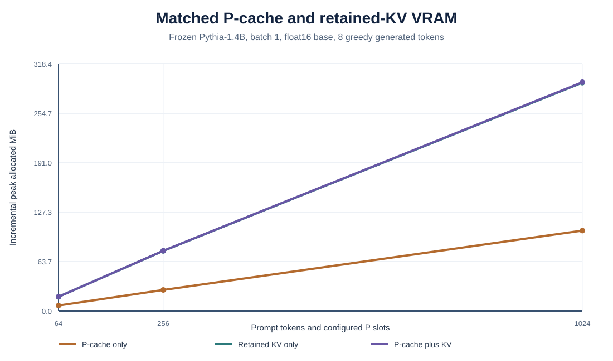
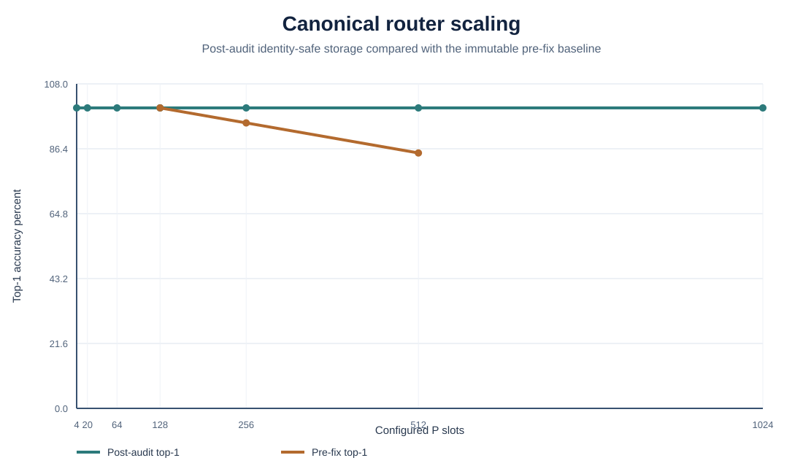
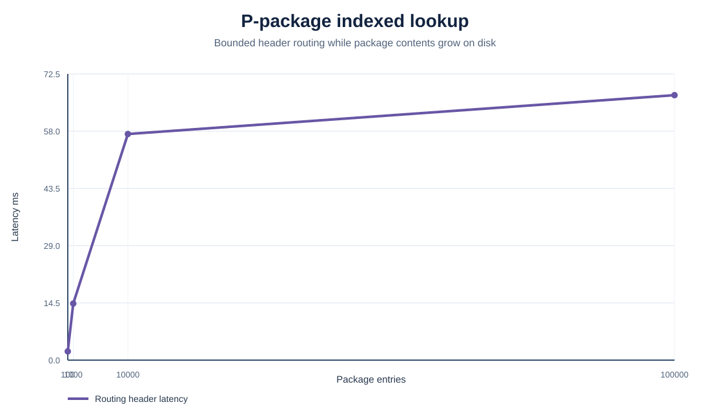

# Benchmarks

This document separates current active results from historical and rejected experiments. Raw artifacts are linked for every headline claim.

## How to read these results

The short explanation before each table states what was tested, why it matters, and what the result does not prove. The tables then preserve the exact measurements.

An **active path** is one where routing accepted state and enabled the compatibility layer. An **inactive path** is rejected, invalidated, absent, or disabled and should match the frozen base. A **causal test** keeps the prompt and recent context fixed while changing only P. **KL divergence** measures how far the complete output distribution moved from the base. **Incremental VRAM** is additional peak GPU allocation above the same warmed model baseline. **Retained KV** is recent token-level attention memory, while canonical P is structured current state.

## Current architecture

### Active test suite

The final pre-release count is recorded in `FINAL_RELEASE_AUDIT.md`. Coverage includes exact Pythia-1.4B semantic and Gemma4 Q8 lexical paths, `.ppkg` regressions, natural post-turn memory review, adversarial state operations, serialization corruption, protocol mismatch, frozen-base gradient isolation, concurrent SQLite reads and writes, matched VRAM artifact validation, and a structural GPT-2 portability test.

Evidence: [`tests/`](tests/) and [`active-system-audit.json`](artifacts/active-system-audit.json).

### Natural post-turn memory review

**What happened:** ordinary role-play wording created and later updated one current location fact without explicit `remember:` syntax. **Why it matters:** P-cache can be populated from normal interaction. **Boundary:** this is a controlled proof over a narrow relation set, and review took tens of seconds on the recorded hardware.

The hidden reviewer passed deterministic tests for natural RP creation and
modification, explicit correction, invalidation, equivalent paraphrase merge,
pronoun resolution with bounded context, transient chatter rejection,
unsupported assistant-claim rejection, malformed JSON rejection, and atomic
rollback. Real Gemma and Pythia interactive acceptance runs created a brass-key
location and then modified the same active slot from kitchen drawer to coat
pocket without explicit memory syntax.

The visible browser response is flushed before review. Exact native-prompt
equivalence remains separately tested when P and LTL are inactive. Review latency
on the recorded hardware was 43 to 48 seconds for Gemma and about 65 seconds for
the Pythia path's CPU structured reviewer.

Evidence: [`post-turn-memory-review-acceptance.json`](artifacts/post-turn-memory-review-acceptance.json) and [`gemma-native-prompt-equivalence.json`](artifacts/gemma-native-prompt-equivalence.json).

### Matched P-cache and retained-KV VRAM

**What happened:** canonical P used about 2.05 MiB at the 1,024-unit case, compared with about 193.31 MiB for retained KV tensors. That is about a 94-fold representation-size difference. **Why it matters:** bounded semantic state can be much smaller than retaining the same count of token positions. **Boundary:** P and KV store different information, and the peak figures include temporary computation rather than only cache tensors.



| Workload | P-cache only | Retained KV only | P-cache plus KV |
|---:|---:|---:|---:|
| 64 tokens and slots | 7.125 MiB | 18.392 MiB | 18.425 MiB |
| 256 tokens and slots | 27.164 MiB | 77.426 MiB | 77.556 MiB |
| 1,024 tokens and slots | 103.491 MiB | 294.266 MiB | 294.783 MiB |

Values are incremental peak allocated VRAM above one warmed loaded-stack
baseline. The frozen Pythia-1.4B model, hardware, prompt lengths, batch size,
precision, TTL, generation method, and eight generated tokens are matched.
Canonical P allocation and retained KV tensor bytes are reported independently
in the raw artifact. Attention working memory remains present in every condition,
so peak VRAM is not interpreted as a semantic equivalence between P and KV.

All nine conditions completed without OOM, fallback, or estimated results.
Evidence: [`vram-comparison.json`](artifacts/vram-comparison.json),
[`vram_comparison.csv`](assets/vram_comparison.csv), and
[`VRAM_COMPARISON.md`](assets/VRAM_COMPARISON.md).

### Post-audit router scaling

**What happened:** the router selected the correct state first on every controlled query through 1,024 slots. **Why it matters:** the earlier large-cache accuracy decline came from incorrect state merging, not an unavoidable ranking collapse. **Boundary:** index hydration still grows linearly and is reported separately.

| Slots | Top-1 | Top-4 recall | MRR | Rank latency |
|---:|---:|---:|---:|---:|
| 4 | 100% | 100% | 1.0 | 0.32 ms |
| 20 | 100% | 100% | 1.0 | 0.60 ms |
| 64 | 100% | 100% | 1.0 | 0.40 ms |
| 128 | 100% | 100% | 1.0 | 0.58 ms |
| 256 | 100% | 100% | 1.0 | 0.47 ms |
| 512 | 100% | 100% | 1.0 | 0.56 ms |
| 1,024 | 100% | 100% | 1.0 | 0.64 ms |

The exact values are generated in [`router_scaling.csv`](assets/router_scaling.csv) from [`active-system-audit.json`](artifacts/active-system-audit.json).

The audit localized the earlier 256 and 512 degradation to cross-identity semantic merge in storage. Identity-safe merge restored the matched router result without increasing top-k.



### Index hydration

Router ranking is sub-millisecond, but rebuilding byte anchors for every configured slot measured 14.91 ms at 64 slots, 30.12 ms at 128, 59.16 ms at 256, 117.42 ms at 512, and 233.00 ms at 1,024. This linear hydration cost is a current optimization target.

### Matched CUDA causality

**What happened:** changing only the valid owner state switched generation from Alice to Bob. Rejected or disabled conditions reproduced the base candidate logits. **Why it matters:** this distinguishes causal use from retrieval alone. **Boundary:** it is a controlled candidate task, not a broad reasoning benchmark.

| Condition | Accepted | Gate | Alice logit | Bob logit | Generated |
|---|---:|---:|---:|---:|---|
| Frozen base | no | 0 | 7.0273 | 6.1211 | ` able` |
| Correct Alice state | yes | 0.9909 | 40.0313 | 13.8594 | ` Alice` |
| Correct Bob state | yes | 0.9605 | 14.0000 | 37.1563 | ` Bob` |
| Wrong entity | no | 0 | 7.0273 | 6.1211 | ` able` |
| Wrong relation | no | 0 | 7.0273 | 6.1211 | ` able` |
| Historical | no | 0 | 7.0273 | 6.1211 | ` able` |
| Invalidated | no | 0 | 7.0273 | 6.1211 | ` able` |
| Translator disabled | yes at router | 0 | 7.0273 | 6.1211 | ` able` |

Prompt and recent KV were identical. Source-state tokens and extra prompt tokens were both zero. The frozen base received zero gradients. See [`active-system-cuda-attribution.json`](artifacts/active-system-cuda-attribution.json) and generated [`causal_conditions.csv`](assets/causal_conditions.csv).

### Split router and Pythia TTL proof

**What happened:** the separated router and TTL passed the 128-slot held-out generation target while the base model stayed frozen. **Why it matters:** it localized state selection and model consumption as distinct responsibilities. **Boundary:** trained semantic support is proven for Pythia-1.4B, not every decoder family.

The selected final-layer Pythia TTL has 2,707,464 parameters and the canonical router has five parameters. At the 128-slot proof target, the pre-audit split benchmark recorded 100% top-1 routing, 100% state generation, exact mutation-chain accuracy, zero invalidated logit difference, and numerical-zero RP KL on the disjoint preservation set.

The original phase artifact recorded 95% at 256 slots and 85% at 512 before the identity-safe merge fix. Those values remain immutable historical measurements. Current post-audit router-only scaling is reported separately above.

Evidence: [`phase-b-split-translator.json`](artifacts/phase-b-split-translator.json), [`0005-split-router-translator.md`](evidence/decisions/0005-split-router-translator.md), and [`0008-active-planner-cache-audit.md`](evidence/decisions/0008-active-planner-cache-audit.md).

### Historical bounded Gemma residual proof

**What happened:** the historical two-value control path made the frozen GGUF emit Alice or Bob and stayed inert on rejected routes. **Why it matters:** it proved that canonical state could causally affect a quantized llama.cpp runtime. **Boundary:** two fitted values and high Bob KL do not establish open-vocabulary semantic compatibility.

This result predates the TTL and LTL distinction. The same canonical store and router drove a 3,073-parameter Gemma-specific `.translate` package through llama.cpp build 10276. The frozen 7.5B Gemma4 Q8 GGUF was attached at layer 41 through the public control-vector API. The prompt and seven-token KV state were identical in every condition. No source-state or extra prompt tokens were present.

| Condition | Accepted | Gate | Alice logit | Bob logit | Generated | KL from base |
|---|---:|---:|---:|---:|---|---:|
| P disabled | no | 0 | 23.1686 | 12.0706 | ` the` | 0 |
| Correct Alice | yes | 1 | 26.0794 | 0.9100 | ` Alice` | 0.6043 |
| Correct Bob | yes | 1 | 7.2262 | 26.6650 | ` Bob` | 9.6385 |
| Wrong entity | no | 0 | 23.1686 | 12.0706 | ` the` | 0 |
| Wrong relation | no | 0 | 23.1686 | 12.0706 | ` the` | 0 |
| Historical | no | 0 | 23.1686 | 12.0706 | ` the` | 0 |
| Invalidated | no | 0 | 23.1686 | 12.0706 | ` the` | 0 |
| Translator disabled | yes at router | 0 | 23.1686 | 12.0706 | ` the` | 0 |

The supplied `llama-server` independently generated ` Alice` and ` Bob` with the corresponding translated control strengths. Three irrelevant natural-RP conditions reproduced the baseline full-vocabulary logits exactly. The adapter occupied 13,356 bytes on disk, copied 10,240 bytes per relevant activation, used no inactive VRAM, and left the base file unchanged.

This is a bounded causal-consumption proof. It uses an analytic affine fit for two canonical values and a frozen token-row direction. llama.cpp does not expose intermediate hidden states through `llama-server`, so this path does not establish model-hidden query projection, unseen-name query generalization, open-vocabulary values, or acceptable preservation under every relevant injection. The Bob condition's KL of 9.6385 is a measured limitation.

Evidence: [`gemma4-e4b-q8-causal.json`](artifacts/gemma4-e4b-q8-causal.json), [`gemma_causal_conditions.csv`](assets/gemma_causal_conditions.csv), and [`0009-gemma4-llama-gguf-translate.md`](evidence/decisions/0009-gemma4-llama-gguf-translate.md). The rejected adapter binary is not distributed.

### Rejected open-vocabulary Gemma translator

**What happened:** a much larger lexical mapper improved some target logits but failed held-out generation. **Why it matters:** matching input-embedding geometry was not enough to control output. **Conclusion:** the design was rejected and is preserved only as negative evidence.

A general trainer enumerated all 262,144 GGUF vocabulary entries and trained a 504,706-parameter UTF-8 byte encoder plus low-rank model projection. The strict manifest used 230,048 unique lexical training values, 25,514 held-out vocabulary values, 8,192 multi-token compositions, 2,048 hard-negative state values, and 1,120 held-out complete strings across seven categories.

The experiment did not pass. Held-out vocabulary retrieval was 45.56%. Complete-string retrieval ranged from 0.63% for numbers, synthetic strings, and unseen names to 13.13% for locations. A balanced stock-libllama causal diagnostic produced 0% first-token and exact-match accuracy in every category. Correct-token logits usually rose, but stronger control scales still failed to generate targets and increased KL. The selected two-value Gemma artifact remains unchanged.

| Measure | Selected two-value adapter | Rejected lexical adapter |
|---|---:|---:|
| Parameters | 3,073 | 504,706 |
| File size | 13,356 B | 2,021,856 B |
| Proven generated values | 2 of 2 | 0 of 35 balanced held-out probes |
| Held-out complete-string evidence | Not claimed | 0.63% to 13.13% retrieval by category |
| Inactive VRAM | 0 B | 0 B by the same on-demand runtime boundary |
| Active llama.cpp control buffer | 419,840 B | 419,840 B |
| Extra prompt tokens | 0 | 0 |
| Measured generation latency | 312.70 to 320.23 ms for target one-token conditions | 504.54 to 1,265.19 ms category means with target-length decoding |
| Inactive behavior | Exact full-logit identity | Exact by disabled control path |
| Relevant RP preservation | Bob KL 9.6385 limitation | Not advanced to RP preservation after 0% state generation |

Evidence: [`gemma4-e4b-q8-lexical.json`](artifacts/gemma4-e4b-q8-lexical.json), [`gemma4-e4b-q8-lexical-causal.json`](artifacts/gemma4-e4b-q8-lexical-causal.json), and [`0011-general-translate-trainer.md`](evidence/decisions/0011-general-translate-trainer.md).

### Gemma causal-geometry research pass

**What happened:** exact output-row controls reliably selected first tokens, but static residuals failed multi-token strings and compact predictors did not generalize. **Why it matters:** the experiment located a lexical control boundary rather than a general semantic translator. **Conclusion:** it remained research evidence.

The follow-up pass captured every Gemma4 layer through the public llama.cpp
evaluation callback and tested exact runtime-token output rows rather than
approximate byte-mapper outputs.

| Measurement | Result |
|---|---:|
| GGUF tensors inventoried | 720 |
| Layer-probe strings | 320 with 80 held out |
| Best canonical linear probe | 85.0% at layer 1 |
| Exact layer-41 output-row first token | 256 of 256 |
| Exact layer-41 full string | 28 of 256 |
| Multi-token full string | 0% |
| Best compact held-out first token | 42 of 67 at rank 128 |
| Best compact held-out full string | 0 of 67 |
| Inactive maximum full-vocabulary difference | 0 |

Exact output-row controls transferred across five neutral prompts with 12 of 12
first tokens in every context. They incurred mean KL between 6.31 and 10.48.
The compact adapter did not preserve that exact geometry and a static residual
repeated the first piece of multi-token values. The experiment was rejected as
general-purpose. The bounded Gemma adapter remains selected.

Evidence: [`gemma4-causal-geometry.json`](artifacts/gemma4-causal-geometry.json), [`gemma4-causal-geometry.md`](artifacts/gemma4-causal-geometry.md), and [`0012-gemma-causal-geometry.md`](evidence/decisions/0012-gemma-causal-geometry.md).

### Gemma sequence-aware causal prototype

**What happened:** advancing one model-native control per emitted token solved most of the earlier multi-token failure. **Why it matters:** the failure was partly caused by using one static residual for an entire string. **Boundary:** the method is token scheduling and was not shown to provide internal semantic reasoning.

The next pass verified the exact workspace Gemma bundle against the Q8 GGUF.
All 262,144 vocabulary entries, architecture dimensions, special IDs, and 14
repeated runtime tokenization probes matched. The prototype then applied the
previously validated layer-41 tied-output control separately for each target
token. Control advances only after the expected token and stops on mismatch or
completion.

| Evaluation | Values | First token | Exact full string | Mean KL | Mean residual norm |
|---|---:|---:|---:|---:|---:|
| Controlled categories | 13 | 100% | 100% | 10.8833 | 8.0 |
| Disjoint scale set | 128 | 100% | 97.65625% | 6.6101 | 8.0 |

The 128-value set includes unseen names, locations, objects, statuses, numbers,
nonsense strings, multi-word values, and UTF-8 text. Three strings failed at
strength 8. A strength-12 failure-subset diagnostic fixed those three, but that
setting was not selected globally. Rejected and irrelevant routes remained
exactly base-equivalent. Matched logits also returned exactly to base after a
completed controlled sequence and control shutdown.

This resolves the static experiment's zero-percent multi-token boundary. It is
still a research prototype because the 1,000-value final gate and broad active
RP evaluation were not run.

Evidence: [`gemma4-sequence-causal-summary.json`](artifacts/gemma4-sequence-causal-summary.json), [`gemma4-sequence-causal-controlled.json`](artifacts/gemma4-sequence-causal-controlled.json), [`gemma4-sequence-causal-heldout-128.json`](artifacts/gemma4-sequence-causal-heldout-128.json), and [`0013-gemma-sequence-aware-translate.md`](evidence/decisions/0013-gemma-sequence-aware-translate.md).

### Active Gemma LTL selection from the sequence complexity audit

**What happened:** direct adaptive logit bias matched or exceeded the sequence controller with lower KL, lower latency, and no learned parameters. **Why it matters:** the simpler mechanism already provided nearly all measured lexical behavior. **Conclusion:** Gemma is classified as LTL output support, not TTL semantic support.

A matched audit tested whether the sequence result reflected learned semantic
translation or direct lexical forcing.

| Variant | First token | Full string | Active KL | Controlled decode ms | Parameters |
|---|---:|---:|---:|---:|---:|
| Direct adaptive logit bias | 100% | 100% | 3.2561 | 1,284.71 | 0 |
| Static mean output-row residual | 18.75% | 0% | 4.0858 | 323.98 | 0 |
| Calibrated strength-6 sequence | 100% | 82.03125% | 5.6896 | 1,123.48 | 1 |
| Rank-16 residual projection | 25% | 0% | 5.8226 | 363.06 | 43,520 |
| Current strength-8 sequence | 100% | 97.65625% | 6.6101 | 1,205.70 | 1 |

All variants used the same 128 held-out complete values. Inactive paths were
exact for every variant. Direct logit bias improved exact accuracy and reduced
KL by 50.74 percent, though it was 6.55 percent slower in controlled decoding.

The audit classifies the sequence residual as lexical token forcing. Exact
token IDs come from the tokenizer and are explicitly targeted one at a time.
For exact selected-string emission, direct adaptive logit bias is preferred and
is now formalized as the zero-parameter Gemma `.ltl`. It is an output constraint,
not semantic translation. The existing residual artifacts remain unchanged as
historical internal-intervention baselines.

Evidence: [`gemma4-sequence-complexity-audit.json`](artifacts/gemma4-sequence-complexity-audit.json), [`gemma4-sequence-complexity-audit.md`](artifacts/gemma4-sequence-complexity-audit.md), and [`0014-gemma-sequence-complexity-audit.md`](evidence/decisions/0014-gemma-sequence-complexity-audit.md).

### P-package mechanical behavior

**What happened:** weak isolated evidence did not create durable personality state, repeated and cross-context evidence did, and explicit correction overruled unsupported model claims. **Why it matters:** durable personalization remains auditable and conservative. **Boundary:** this tests deterministic memory mechanics, not nuanced learned personality.

- One weak event did not promote.
- Three independent repeated events promoted.
- Three linked cross-context events scored 2.5865 compared with 1.8000 for five narrow-context events.
- Twenty unsupported model-generated claims did not promote.
- An explicit correction promoted and marked the old conclusion `superseded`.
- Technical, creative, and relationship-specific retrieval were correct in the proof workload.
- Irrelevant retrieval loaded zero entries.

Evidence: [`phase-b-personality-package.json`](artifacts/phase-b-personality-package.json).

### P-package scaling after indexed filtering

**What happened:** the 100,000-entry package narrowed the query to 152 headers and loaded four rows. **Why it matters:** active memory depends on selected entries rather than total disk size. **Boundary:** header scoring still took 67.10 ms and is not constant-time.

| Entries | Disk | Header routing | Hydration | Canonical conversion | Headers | Loaded | Inactive VRAM |
|---:|---:|---:|---:|---:|---:|---:|---:|
| 100 | 118,784 B | 2.21 ms | 0.116 ms | 0.550 ms | 4 | 4 | 0 B |
| 1,000 | 638,976 B | 14.33 ms | 0.118 ms | 0.491 ms | 33 | 4 | 0 B |
| 10,000 | 5,894,144 B | 57.26 ms | 0.113 ms | 0.510 ms | 130 | 4 | 0 B |
| 100,000 | 58,720,256 B | 67.10 ms | 0.118 ms | 0.495 ms | 152 | 4 | 0 B |

The previous bounded-header implementation measured 255.078 ms at 100k. Indexed coarse filtering reduced it to 67.10 ms, a 3.80x improvement. The added indexes increased synthetic package disk size from approximately 37 MB to 58.7 MB.



Evidence: [`ppkg_scaling.csv`](assets/ppkg_scaling.csv), [`active-system-audit.json`](artifacts/active-system-audit.json), and [`ppkg-100k-profile.json`](artifacts/ppkg-100k-profile.json).

The separate debug-action audit found that unbounded `/personality` inspection
would hydrate 100,000 rows, allocate about 173 MB in Python, and produce 61 MB
of JSON. Bounded pagination reduced the action to 21.8 ms, about 196 KB peak
Python allocation, and a 60 KB response. `/state` remained clean and bounded by
configured P slots.

## Historical and rejected architecture benchmarks

### Self-trained base phase

The 15.7M model failed the fixed coherence gate after 166M training tokens. The 98.7M model reached held-out loss 1.674 and perplexity 5.336 after 165,974,016 training tokens, but still drifted or repeated. A 248.1M CUDA accumulation and checkpoint regression passed after disabling CUDAGraphs while retaining Inductor, but the long 250M training run was not started. The project then pivoted to frozen Pythia-1.4B.

Evidence: [`0001-phase-a-decisions.md`](evidence/history/decisions/0001-phase-a-decisions.md) and archived logs under [`old-training`](evidence/history/README.md).

### Mechanical P-cache and baseline comparison

On a 640-state workload with a 32-event recent window, KV-only recall was 0%, 128-slot P recall was 19.97%, equal-capacity rolling summary recall was 19.97%, and unbounded archive retrieval was 100%. This result did not establish reader quality. It established fixed allocation, mutation, invalidation, and capacity behavior.

The importance-pressure workload used 1,024 active candidates. At 128 slots, P retained 100% of critical state while the equal-capacity rolling summary retained 11.72%. See the archived mechanical artifacts and decision record.

Evidence: [`phase-b-benchmark.json`](evidence/history/rejected-readers/phase-b-benchmark.json), [`phase-b-final-mechanics.json`](evidence/history/rejected-readers/phase-b-final-mechanics.json), and [`0002-pythia-base-pivot.md`](evidence/history/decisions/0002-pythia-base-pivot.md).

### Reader variants

Nine reader variants remained at 25% held-out state accuracy. Preservation regularization reduced RP drift, but did not solve held-out generation. The final-layer cross-attention baseline produced RP loss 6.4748 and KL 0.6575. The upper-four-layer preservation variant stayed close to frozen RP loss at 5.2921 with KL 0.00363, but still achieved only 25% state accuracy.

Evidence: [`phase-b-reader-variants.json`](evidence/history/rejected-readers/phase-b-reader-variants.json).

### Factorized representation localization

The canonical representation probe reached 97.27% held-out state recovery, 100% canonical field decoding, 100% wrong-value and historical discrimination, 97.27% wrong-entity discrimination, and 100% permutation stability. Pythia reader generation still failed, which localized the problem downstream of canonical representation.

Evidence: [`phase-b-factorized-representation.json`](artifacts/phase-b-factorized-representation.json).

### Bridge and LoRA fallback

The bridge retrieved all held-out hard-negative sets and mapped canonical values with 100% accuracy, but bridge-only generation remained unchanged at 20.83%. Adding rank-4 LoRA reduced generation loss but produced 0% held-out state generation and worsened RP loss to 5.4675. LoRA was rejected from the active architecture.

Evidence: [`phase-b-p-bridge.json`](evidence/history/rejected-readers/phase-b-p-bridge.json).

### Monolithic translator

The monolithic translator proved P-only causal directionality and value translation, but global 20-fact retrieval stayed at 65% to 70%, unseen-name accuracy remained 0% to 25%, and wrong-entity gating was too permissive. Upper-layer attachment improved state generation to 65% while degrading RP loss to 5.7049. The design was rejected in favor of a separate canonical router.

Evidence: [`phase-b-translator.json`](evidence/history/rejected-translators/phase-b-translator.json) and [`0004-bidirectional-p-translator.md`](evidence/history/decisions/0004-bidirectional-p-translator.md).

## Reproduction

```bash
PYTHONPATH=src .venv/bin/python benchmarks/audit_active_system.py
PYTHONPATH=src .venv/bin/python benchmarks/audit_cuda_e2e.py
PYTHONPATH=src .venv/bin/python -m pytest -q
```

The CUDA benchmark requires the local Pythia-1.4B checkpoint and the selected `.ttl` and `.router` artifacts.

The exact Gemma regression additionally requires the recorded GGUF and llama.cpp build. Run it with:

```bash
PYTHONPATH=src .venv/bin/python benchmarks/gemma_llama_translate.py \
  --llama-root "$LLAMA_CPP_DIR" \
  --model "$GEMMA_MODEL"
```
