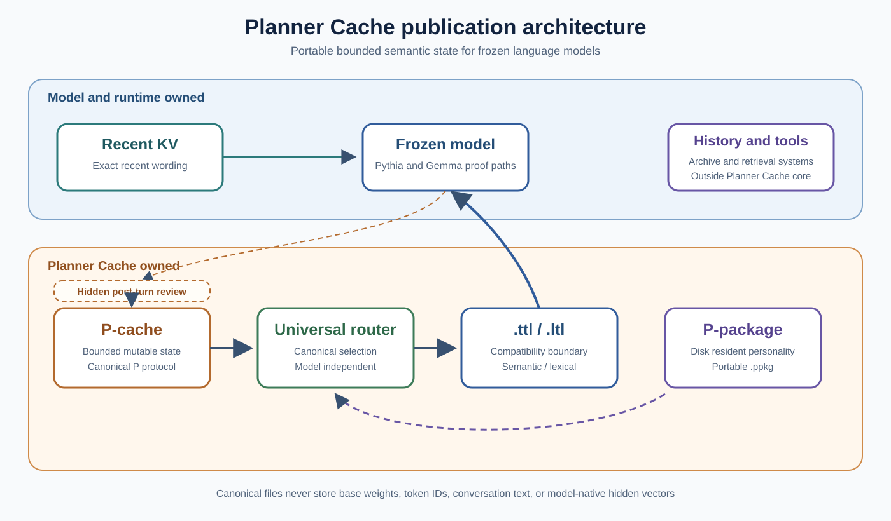

# Planner Cache

Planner Cache gives a frozen language model a small, bounded memory for facts that can change. It stores current state outside the prompt, selects only relevant state, and passes that state to the model through a small compatibility layer. It does not train or modify the base model.

> Planner Cache allows mutable semantic state to remain available independently of retained token-level conversation history.



## Why

Token-level KV is good at preserving recent wording, but it is not a natural database for facts that are corrected, transferred, invalidated, or scoped. Planner Cache represents current semantic state explicitly while leaving exact recent wording to the model runtime.

The project does not claim to eliminate long context. Archive search, tool retrieval, transcript storage, and recent-KV policy remain responsibilities of the surrounding runtime.

## Terms in plain English

- **P-cache** is the fixed-capacity store for facts that are currently true, such as who owns an object or where it is now.
- **Canonical P** is the model-independent representation used inside that store. It contains structured semantic state and metadata, not prompt tokens or model hidden vectors.
- **Canonical router or `.router`** selects the stored state that matches the current entity and relation. It runs before any model-specific conversion.
- **Tensor Translation Layer or `.ttl`** converts selected canonical state into a model's internal hidden-state space. This is the stronger semantic or internal support level.
- **Lexical Translation Layer or `.ltl`** converts a selected value into tokenizer or output controls. It can make a runtime emit the routed value, but it does not prove that the model reasoned internally over that value.
- **P-package or `.ppkg`** is a disk-resident store for durable personality and interaction patterns. It promotes conclusions only after enough repeated or authoritative evidence.
- **Retained KV** is the model runtime's token-level key-value cache for recent context. It preserves recent wording and grows with retained tokens.
- **Active path** means a route was accepted and TTL or LTL was enabled. **Inactive path** means memory was absent, rejected, invalidated, or disabled, so the compatibility layer should leave base behavior unchanged.
- **Causal intervention** means the prompt and recent context stay fixed while only canonical P changes. A predictable output change then shows that P caused the change.
- **KL divergence** is a measure of how much the model's output distribution changed from the frozen base. Zero means identical distributions. Larger values mean a stronger intervention.
- **Incremental VRAM** is the extra peak GPU memory above the same warmed model baseline.

## Core components

- **P-cache** stores bounded current mutable state with fixed physical allocation and explicit `KEEP`, `CREATE`, `MODIFY`, `MERGE`, `INVALIDATE`, and `IGNORE` operations.
- **Canonical router** ranks entity, relation, metadata, validity, and current-state information without using a model hidden width.
- **`.ttl`** is a model-specific Tensor Translation Layer for semantic or internal compatibility. Pythia-1.4B is the trained reference.
- **`.ltl`** is a model and runtime-specific Lexical Translation Layer for tokenizer or output control. Gemma4 E4B Q8 with llama.cpp is the reference.
- **P-package or `.ppkg`** stores durable personality and behavioral conclusions on disk, promotes them from repeated or authoritative evidence, and hydrates only relevant entries.
- **Post-turn memory review** is a hidden model-based side-channel that proposes canonical P operations after the visible reply. It never rewrites the browser message sequence or routes review output through TTL or LTL.

## Measured results

The main result is not simply that state can be retrieved. Changing only a valid P entry changed the model's answer, while wrong, historical, invalidated, or disabled state left the tested base logits unchanged.

The memory comparison also separates representation size from total execution peaks. At 1,024 memory units, canonical P occupied about 2.05 MiB while retained KV occupied about 193.31 MiB. Canonical P was therefore about 94 times smaller in this matched representation-size comparison. Peak execution memory was 103.49 MiB for P-only and 294.27 MiB for KV-only because both paths also need temporary model computation.

| Result | Measured outcome |
|---|---:|
| Post-audit canonical routing | 100% top-1 and MRR 1.0 through 1,024 slots |
| Pythia held-out state generation at 128 slots | 100% on the controlled split-translator benchmark |
| Wrong entity, wrong relation, historical, and invalidated CUDA paths | Frozen-base logits restored exactly in the matched audit |
| Frozen-base parameters receiving gradients | 0 |
| Pythia `.ttl` parameters | 2,707,464 |
| Gemma 4 E4B Q8 GGUF causal values | `Alice` and `Bob` generated when only canonical P changed |
| Gemma inactive rejection paths | Exact frozen-base logits for wrong entity, wrong relation, historical, invalidated, and disabled state |
| Selected Gemma `.ltl` parameters | 0 |
| Gemma sequence research prototype | 125 of 128 exact disjoint strings, 100% first-token accuracy |
| Gemma direct lexical actuator audit | 128 of 128 exact strings, KL 3.2561, zero fitted parameters |
| 100k `.ppkg` indexed header routing | 67.10 ms in the recorded audit profile |
| 100k `.ppkg` entries hydrated | 4 from 152 candidate headers |
| Inactive `.ppkg` VRAM | 0 bytes |
| Natural review acceptance | RP location `CREATE` followed by current-state `MODIFY` in both interactive runtime paths |
| Matched 1,024-token VRAM, P-only / KV-only / combined | 103.491 / 294.266 / 294.783 MiB incremental peak allocated |

See [BENCHMARKS.md](BENCHMARKS.md) for conditions, historical baselines, and links to raw JSON.

## Quick start

Create the project environment and run the active tests.

```bash
python -m venv .venv
.venv/bin/pip install -e '.[dev]'
PYTHONPATH=src .venv/bin/python -m pytest -q
```

Interactive launchers require local model and runtime paths and contain no
machine-specific absolute defaults.

```bash
export LLAMA_CPP_DIR=/path/to/llama.cpp
export GEMMA_MODEL=/path/to/compatible-gemma.gguf
export GEMMA_TOKENIZER_BUNDLE=/path/to/matching-tokenizer-bundle
./run-gemma.sh

export PYTHIA_MODEL=/path/to/pythia-1.4b
export REVIEW_MODEL="$GEMMA_MODEL"
./run-pythia.sh
```

The browser's original `system`, `user`, and `assistant` message objects continue
through llama.cpp's native chat-template path. Automatic review begins only after
the visible response is flushed and completes before the next turn.

### Using P-cache

```python
import torch

from pcm.planner import CanonicalPConfig, CanonicalPStore
from pcm.planner import SlotSource

store = CanonicalPStore(CanonicalPConfig(slots=128, width=512))
slot, operation = store.create(
    torch.randn(512),
    entity_id=7,
    relation_id=0,
    value_id=3,
    metadata_id=0,
    label="silver key",
)

store.modify(
    slot,
    torch.randn(512),
    entity_id=7,
    relation_id=0,
    value_id=4,
    metadata_id=0,
    source=SlotSource.CORRECTION,
)

store.save("current-state.safetensors")
```

### Using a Pythia `.ttl`

```python
from transformers import AutoModelForCausalLM

from pcm.planner import ByteEntityEncoder, CanonicalPRouter
from pcm.planner import PythiaSplitTranslatedModel, TensorTranslationLayer

base = AutoModelForCausalLM.from_pretrained(
    "pythia-1.4b",
    local_files_only=True,
    dtype="float16",
).to("cuda")

ttl = TensorTranslationLayer.load(
    "artifacts/pythia-1.4b-final-layer.ttl",
    device="cuda",
)
router = CanonicalPRouter.load("artifacts/canonical-p-v1.router", device="cuda")
model = PythiaSplitTranslatedModel(base, ttl, router, ByteEntityEncoder())
```

The Pythia wrapper is the reference semantic adapter. See [TTL.md](TTL.md). Gemma's lexical or output boundary is documented in [LTL.md](LTL.md).

### Using `.ppkg`

```python
from pcm.planner import PersonalityPackage, PersonalityQuery, PersonalityRouter

with PersonalityPackage("artifacts/personality-proof.ppkg") as package:
    selection = PersonalityRouter().retrieve(
        package,
        PersonalityQuery(
            subject="user",
            interaction_type="technical",
            domain="debugging",
            relation="response_style",
        ),
        top_k=4,
    )

print(selection.route.entry_ids)
```

See [PPKG.md](PPKG.md) for evidence promotion, authority, contradiction, integrity, and activation.

## Proven configurations

- Frozen local Pythia-1.4B with a final-layer GPT-NeoX attachment at layer 23.
- Canonical P protocol `pcm-canonical-p-v1` with width 512.
- Router format `pcm-canonical-router-v1`.
- TTL format `planner-cache-ttl-v1`.
- LTL format `planner-cache-ltl-v1`.
- Personality package format `pcm-personality-package-v1` with protocol `pcm-canonical-personality-v1`.
- A tiny random GPT-2 model passed a structural portability test with a model-specific semantic hook. This is not a trained semantic portability result.
- Gemma 4 E4B Q8 GGUF has LTL support through direct adaptive logit bias in llama.cpp. This provides routed lexical emission and does not demonstrate internal semantic reasoning over P.
- A separate Gemma sequence-aware research adapter reached 97.65625% exact full strings on 128 disjoint values. It is not yet the selected interactive adapter or a general-purpose compatibility claim.
- A complexity audit showed that the sequence result is lexical token forcing rather than learned semantic translation. Direct adaptive logit bias is the preferred exact-string actuator, not a semantic compatibility claim.

## Research history

The project began with a self-trained proof model, pivoted to frozen Pythia-1.4B, rejected several reader and bridge variants, rejected a monolithic translator, and passed the current split router and translator completion gate. See [RESEARCH_HISTORY.md](RESEARCH_HISTORY.md).

## Current limitations

The strongest current limitations are the lack of a full trained open-vocabulary semantic proof on a second model family, the incomplete 1,000-value and active-RP gates for the Gemma sequence prototype, external reconstruction of canonical representation weights, linear router-index hydration, mechanical rather than nuanced personality learning, and slow model-based post-turn review on the measured hardware. See [LIMITATIONS.md](LIMITATIONS.md).

## Citation

Citation metadata is available in [CITATION.bib](CITATION.bib). Author and release metadata should be finalized before a public release.

## License

Base-model weights, tokenizer bundles, datasets, and third-party runtime files are not included in this pack. Historical training-data license notes are recorded in [`THIRD_PARTY_NOTICES.md`](THIRD_PARTY_NOTICES.md). A repository-wide software license is not currently present and is listed as a publication blocker.
